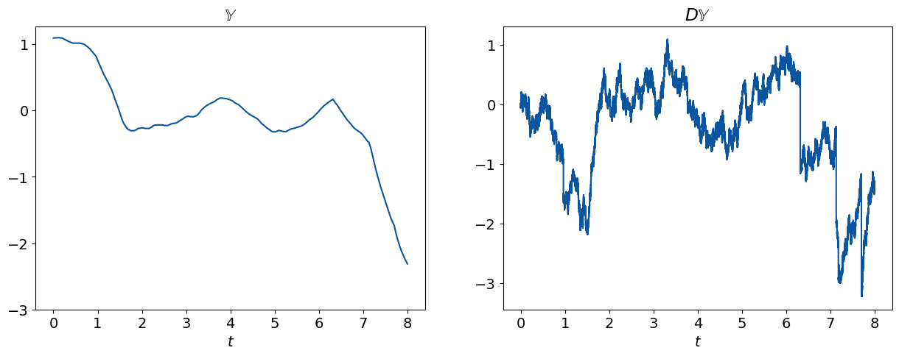

# MCAR

This repository contains code for simulating and estimating Multivariate Continuous-time Autoregressive (MCAR) processes. For an overview of multivariate CAR(MA) processes, see [Marquardt and Stelzer, 2007](https://www.sciencedirect.com/science/article/pii/S0304414906000846). The estimators implemented in this repository are primarily based on the methods developed in [Lucchese et al., 2023](https://arxiv.org/abs/2307.13020).

## Contents

The main methods are located in `mcar.simulate` and `mcar.estimate`. Examples of their usage can be found in the `notebooks` directory. Specifically:
- `mcar-simulation-study.ipynb`: Contains code for a simulation study to evaluate the finite sample empirical properties of the estimators described in [Lucchese et al., 2023](https://arxiv.org/abs/2307.13020).
- `lightcurve-example.ipynb`: Demonstrates an application to real data (an astrophysics light curve) analyzing the spectral properties of the observed time series.

